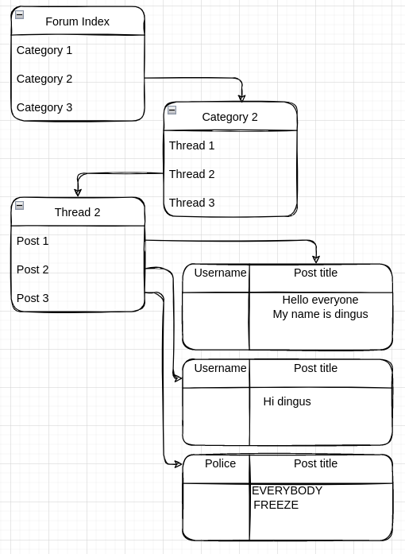

# SharpScape

An online multiplayer community

---

## Repository Overview

`Website/`: Contains the Blazor front-end project files for the web application that users will interact with.
 - This project's root namespace is `SharpScape.Website`.

`Api/`: Contains the ASP.NET Core web API project files for the backend that will serve the website and the game.
 - This project's root namespace is `SharpScape.Api`.
 - The default developmenet database is [SQLite3](https://www.sqlite.org/index.html) for cross-platform compatibility.  Tests will be run against a SQLite3 seeded database using the `Microsoft.EntityFrameworkCore.Sqlite` adapter.  Do not use SqlServer.  In production, the database will be PostgreSQL, and the appropriate adapter will be selected.

`Shared/`: Contains objects that should be shared between `Website` and `Api` projects, such as DTOs.

### Game project

The game will be built using [Godot](https://godotengine.org). The game project repository is located at [cptchuckles/SharpScapeGodotGame](https://github.com/cptchuckles/SharpScapeGodotGame)

## Contributing

Only members of the Summer 2022 Quintrix .NET Cohort may submit contributions to this project.

Initial instructions for cohort members:
 - Fork this repository and clone your fork.  Your fork's URL will be known to git as `origin`.
 - Add *this* repository URL to your git remotes as `upstream`.

From then on:
 - Create a new branch for ***each*** feature you work on, and make your commits to each feature's respective branch.
 - Make sure your branch is up-to-date by pulling `upstream/master` into your feature branch.
 - Push your new branch to your `origin`.  Do not merge it into your `master` branch.
 - Pull-request your feature branch against this repository's `master` branch.

### File Structure: Website

When you create a new page or component, please keep those new files bundled together in a new folder for that page or component.  Folder structure for the Blazor website should look something like this (this is a general example):
```
Website/
| - Components/
|   | - SomeComponent/
|   |       SomeComponent.razor
|   |       SomeComponent.razor.cs  (external code for the component, if needed)
|   |       SomeComponent.razor.css  (custom styles for the component)
|   | - AnotherComponent/
|           AnotherComponent.razor
|           AnotherComponent.razor.cs
| - Pages/
    |   Index.razor
    |   Login.razor
    |   Register.razor
    | - Forum/
            ForumIndex.razor
            ForumIndex.razor.cs
```
    
Static files for the website, like images, or global javascript or stylesheets, should go in `wwwroot/<category>/filename.*` such as:
```
Website/
| - wwwroot/
    | - css/
    |       some-more-styles.css
    | - scripts/
    |       some-javascript.js
    | - assets/
        |   login-button.png
        | - forum/
                forum-titlebar.jpg
```

and so on.  These files can be linked in the markup as relative paths starting at `wwwroot`, e.g:
```html
<link rel="stylesheet" href="css/some-more-styles.css" />


```

### Forum structure

The structure of the forum should be as so:
 - Forum Index
    - Categories
        - Threads
            - Posts

The forum index shows the list of Categories.

A Category shows a list of Threads.

A Thread is a list of Posts.

A Post is a message made by a User.



### Game architecture

Here is a tentative diagram of how the game client+server and backend API+DB are going to work together:


